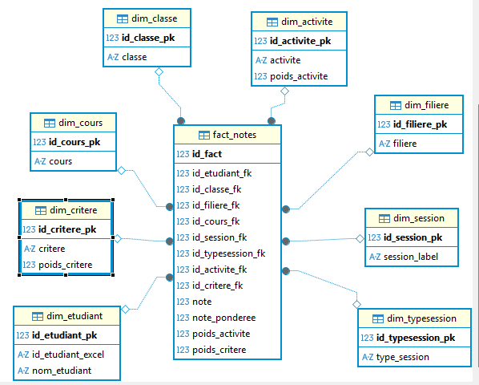

# Student-Performance-Data-Warehouse-and-Visualization

## Table of Content
- [Summary](#summary)
- [Dataset](#dataset)
- [Data Warehouse](#data-warehouse)

## Summary 
This is an end-to-end data engineering and analytics project focused on transforming raw academic evaluation data into reliable insights. The project integrates ETL pipelines built with **Talend** to extract, clean, and load **csv data** into a **PostgreSQL data warehouse** structured in **Star Model**. On top of this warehouse, a full web analytics platform is developed using **Django (backend API)** and **React.js (frontend)** to deliver dynamic dashboards and personalized views for administrators, professors, and students. The system provides indicators on student performance, course efficiency, evaluation criteria, and activity weighting, enabling data-driven academic decisions.

## Dataset

The dataset contains **34,135 evaluation entries** and **13 columns**, where each row represents a student’s score on a specific criterion within an activity for a given course session. It combines academic context (class, filière, course) with evaluation details (activity, weights, notes) to support multi-level performance analysis.

#### **Columns and Descriptions**

* **ID Étudiant** — Unique identifier of the student.
* **Nom Étudiant** — Pseudonym or label representing the student.
* **Classe** — The class or group the student belongs to.
* **Filière** — The academic program or specialization (e.g., IOT).
* **Cours** — The name of the course being evaluated.
* **Session** — The specific session of the course (e.g., Session 1).
* **Type de Session** — Nature of the session (Cours, TD, Examen, etc.).
* **Activité** — The evaluated activity within the session (e.g., Participation, Devoir).
* **Poids Activité** — Weight assigned to the activity in the course evaluation.
* **Critère** — The specific evaluation criterion (e.g., Participation orale).
* **Poids Critère** — Weight of the criterion within the activity.
* **Note** — Raw score obtained by the student for this criterion.
* **Note Pondérée** — Weighted score based on activity and criterion weights.

## Data Warehouse

